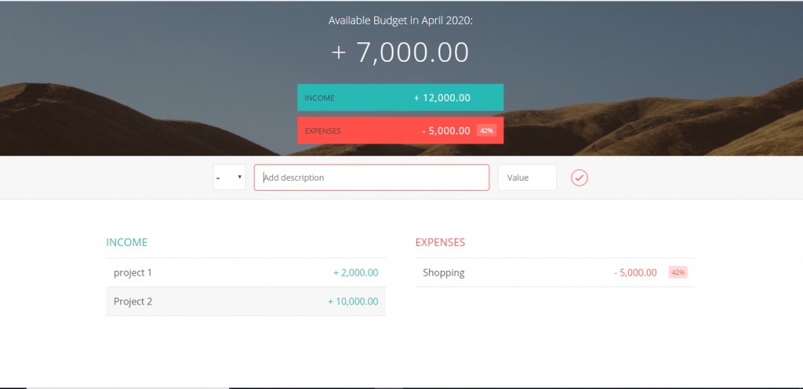

<h1 align="center">JavaScript-TheBudgetApp</h1>
<a href="#">
  

    
  

</a>

## <h2 align = "center"> [Tap to see more about this app](https://hirashahid.thecloudsoft.com/js-thebudgetapp/)</h2>

## What This App does:
-[x] Users can add expenses and income to calculate the budget using this application.
-[x] I have used many concepts of JavaScript while building this application.
-[x] Users can also be able to delete the entered item. When the item would be deleted, the budget would be updated.

## Author
You can get in touch with me on my LinkedIn Profile:

#### Hira Shahid

You can also follow my GitHub Profile to stay updated about my latest projects: 

If you liked the repo then kindly support it by giving it a star ⭐!

## LICENSE
- MIT (2021)
